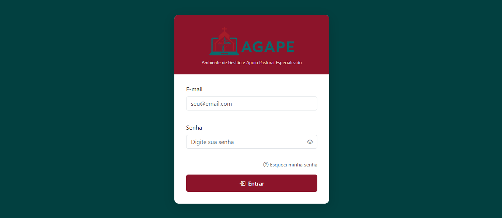

<div align="center">

# AGAPE

### Ambiente de Gestão e Apoio Pastoral Especializado

Sistema web de gestão paroquial desenvolvido pelo **Grupo 1** como projeto acadêmico da disciplina de **Engenharia de Software II — Bacharelado em Sistemas de Informação, 2026.1**.


</div>

---

## Visão geral

O AGAPE é uma aplicação web multipágina para apoiar atividades administrativas e operacionais de uma paróquia. O sistema reúne autenticação por perfil, cadastros, parametrização institucional, gestão de eventos e inscrições, caixa, compras, vendas e devoluções.

O frontend é composto por páginas HTML, CSS e JavaScript executadas no navegador. Ele se comunica por HTTP com um backend Java independente, que expõe uma API JSON na porta `8080` e persiste os dados em MySQL por meio de JDBC.

O projeto não utiliza framework web Java, gerenciador de dependências, bundler ou framework de frontend. As principais dependências estão versionadas diretamente no repositório.

## Funcionalidades implementadas

### Acesso e usuários

- Autenticação por e-mail e senha.
- Emissão e validação de token JWT com validade de oito horas.
- Perfis `ADM`, `COLAB` e `PAROQ`, com menus e permissões diferentes.
- Troca obrigatória de senha no primeiro acesso.
- Cadastro, consulta, alteração, ativação, desativação, exclusão e redefinição de senha de usuários.
- Restrições para impedir que um usuário desative ou exclua a própria conta e para preservar ao menos um administrador ativo.
- Colaboradores podem cadastrar e manter usuários do perfil paroquiano; operações administrativas sensíveis permanecem restritas ao perfil administrador.

### Cadastros e parametrização

- CRUD de produtos e categorias de produto.
- CRUD de categorias de evento e status de evento.
- CRUD de formas de pagamento, incluindo indicação de suporte a parcelamento.
- CRUD de fornecedores.
- Parametrização dos dados institucionais da entidade.
- Envio de logotipos e imagens de eventos em Base64, com gravação em `FrontEnd/assets/img`.
- Consulta de CEP pelo ViaCEP e de CNPJ pela BrasilAPI nas telas aplicáveis.

### Eventos e inscrições

- Cadastro e edição de eventos com categoria, responsável, período de inscrição, data do evento, vagas, valor e imagem.
- Abertura, reabertura, adiamento, cancelamento e finalização de eventos.
- Finalização automática de eventos vencidos durante a listagem.
- Consulta dos inscritos e da lista de espera de um evento.
- Inscrição de paroquiano por um operador e autoinscrição do usuário logado.
- Entrada automática na lista de espera quando não há vagas.
- Promoção do primeiro integrante da fila quando uma inscrição ativa é cancelada.
- Cancelamento de inscrição pelo próprio paroquiano ou por operador autorizado.

### Operações financeiras e estoque

- Abertura de caixa por operador.
- Registro de suprimento e sangria, com motivo e validação de saldo.
- Fechamento com resumo de movimentações, vendas e formas de pagamento.
- Registro de compras com fornecedor, nota fiscal, itens, quantidades e valores unitários.
- Atualização de estoque na conclusão de uma compra.
- Ponto de venda com identificação do paroquiano, consulta de produtos, múltiplas formas de pagamento, uso de crédito e indicação de parcelas.
- Bloqueio da venda quando o operador não possui caixa aberto ou quando não há estoque suficiente.
- Estorno transacional de venda, revertendo seus efeitos em estoque, caixa, crédito e contas a receber.
- Devolução parcial ou total de itens vendidos.
- Crédito do valor devolvido ao paroquiano e opção de reincorporar os itens ao estoque.

## Perfis de acesso

| Perfil | Uso principal na interface |
|---|---|
| `ADM` | Acesso administrativo e operacional, incluindo usuários e parametrização. |
| `COLAB` | Operações de caixa, compras, vendas, devoluções, inscrições e cadastros operacionais. |
| `PAROQ` | Consulta de eventos disponíveis, autoinscrição, entrada em lista de espera e cancelamento da própria inscrição. |

As permissões efetivas são verificadas no backend pelo `AuthFilter`. Algumas regras adicionais, especialmente no módulo de usuários, também são verificadas dentro do respectivo handler.

## Arquitetura

O sistema adota uma arquitetura em camadas construída manualmente. O MVC é mais evidente no frontend; no backend, a organização corresponde a handlers HTTP, modelos, DAOs e facades, sem uma camada de View renderizada pelo servidor.

```text
Navegador
  └── Views HTML + scripts da página
        └── Controllers JavaScript
              └── Services JavaScript
                    └── HttpClient (Fetch API)
                          └── API HTTP em Java
                                ├── AuthFilter e handlers C*
                                ├── Facades para casos de uso transacionais
                                ├── Models
                                └── DAOs JDBC
                                      └── MySQL
```

### Frontend

- **Views:** arquivos HTML e scripts específicos de cada tela. Eles renderizam dados, vinculam eventos do DOM e executam validações de apresentação.
- **Models:** representam dados recebidos ou enviados e concentram algumas validações locais.
- **Controllers:** mantêm o estado das telas e coordenam modelos e serviços.
- **Services:** encapsulam as operações HTTP de cada domínio.
- **Utils:** fornecem autenticação, transporte HTTP, máscaras, validações, consultas externas e sidebar responsiva.
- **Namespace global:** os componentes são publicados em `window.AGAPE` e, em sua maioria, implementados por IIFEs com acesso por `getInstance()`.

Trata-se de uma aplicação multipágina, e não de uma SPA. O navegador armazena token e dados básicos do usuário em `sessionStorage`; a preferência de recolhimento da sidebar fica em `localStorage`.

### Backend

- **`Main`:** cria o `com.sun.net.httpserver.HttpServer`, registra os contextos e inicia a API em `http://localhost:8080`.
- **`control`:** contém os `HttpHandler` responsáveis por receber requisições, ler parâmetros, validar entradas, chamar o domínio e montar respostas.
- **`security`:** gera e valida JWT e protege handlers conforme os perfis permitidos.
- **`facade`:** coordena os fluxos transacionais de inscrição, venda e devolução.
- **`model`:** contém entidades e DTOs. Além de representar dados, alguns modelos delegam operações de persistência aos DAOs; `Evento` também concentra regras do ciclo de vida e disponibilidade.
- **`dao`:** executa SQL com JDBC, `PreparedStatement` e `ResultSet` e converte os resultados para os modelos.
- **`util`:** reúne o envelope de resposta, hash de senha, validações auxiliares e tradução de erros de banco.
- **`ConexaoBD`:** singleton que carrega `config.properties` do classpath e mantém uma conexão JDBC compartilhada, reabrindo-a quando necessário.

As respostas seguem, em geral, o envelope:

```json
{
  "status": "ok",
  "code": 200,
  "messages": [],
  "result": {}
}
```

A serialização e a leitura dos corpos são feitas pelo próprio código. Formulários convencionais usam `application/x-www-form-urlencoded`; operações de eventos, inscrições e imagens utilizam JSON em pontos específicos.

## MVC, DAO e padrões de projeto

### MVC e DAO

O frontend possui uma separação explícita entre `views`, `models`, `controllers` e `services`. Os scripts das páginas ainda contêm comportamento de interface e algumas validações, portanto a separação não é absoluta. No backend, os handlers atuam como controladores da API, enquanto os DAOs isolam a maior parte do SQL.

DAO é aplicado por meio de classes concretas como `ProdutoDAO`, `EventoDAO`, `UsuarioDAO`, `VendaDAO` e `CaixaDAO`. Não há interfaces de repositório nem injeção de dependências; handlers, modelos e facades instanciam diretamente as implementações necessárias.

### GOF observado no código

- **Singleton:** utilizado na conexão, autenticação, providers, handlers, controllers e serviços. A implementação é feita por instância estática e métodos `getInstance()` ou `getInstancia()`.
- **Facade:** utilizado de forma explícita em `InscricaoFacade`, `VendaFacade` e `DevolucaoFacade`, que coordenam vários DAOs e regras dentro da mesma transação.

MVC e DAO são padrões arquiteturais/empresariais e não fazem parte do catálogo GOF.

### GRASP observado no código

- **Controller:** handlers `C*` no backend e controllers no frontend recebem e coordenam as ações da aplicação.
- **Information Expert:** entidades como `Evento` e componentes que mantêm o estado de venda ou devolução executam regras ligadas aos dados que conhecem.
- **Creator:** facades e controllers criam os objetos necessários aos respectivos casos de uso.
- **Pure Fabrication:** DAOs, services, `HttpClient` e facades existem para separar responsabilidades técnicas do domínio.
- **Low Coupling / High Cohesion:** são objetivos visíveis na divisão por pacotes e módulos, embora existam dependências diretas entre classes concretas.

### SOLID no estado atual

O código demonstra preocupação com separação de responsabilidades, especialmente entre interface, transporte HTTP, regras transacionais e persistência. Entretanto, não há base técnica para afirmar que os cinco princípios SOLID estejam implementados de forma integral:

- SRP aparece na divisão geral das camadas, mas alguns handlers também fazem parsing, validação, serialização e coordenação de persistência.
- OCP e DIP não são sistemáticos porque não há abstrações ou injeção de dependências para DAOs e serviços.
- A herança entre `Usuario`, `Paroquiano` e `Colaborador` não constitui, por si só, evidência de aplicação completa de LSP.
- Não existem interfaces segregadas que caracterizem uma aplicação explícita de ISP.

Assim, SOLID e GRASP devem ser entendidos como referências usadas no desenvolvimento acadêmico, com aplicações pontuais verificáveis no código.

## API HTTP

Base URL: `http://localhost:8080`

Com exceção de `/login` e `/trocarSenha`, os contextos são protegidos por token Bearer. A API usa verbos e códigos HTTP, mas combina rotas de recursos com subrotas de ação e comandos no corpo; por isso, é descrita aqui como uma **API HTTP JSON inspirada em REST**, e não como uma implementação REST estrita.

### Autenticação e usuários

| Método | Rota | Descrição | Acesso |
|---|---|---|---|
| `POST` | `/login` | Autentica e retorna o token e os dados do usuário. | Público |
| `POST` | `/trocarSenha` | Valida a senha atual e define uma nova senha. | Público, com credenciais atuais |
| `GET` | `/usuarios` | Lista usuários. | `ADM`, `COLAB` |
| `GET` | `/usuario?id={id}` | Consulta por ID; também aceita `cpf` ou `email`. | `ADM`, `COLAB` |
| `POST` | `/usuarios` ou `/cadastrar` | Cadastra usuário com senha inicial do perfil. | `ADM`, `COLAB`, sujeito às regras de perfil |
| `PUT` | `/usuario` | Altera os dados de um usuário. | `ADM`, `COLAB`, sujeito às regras de perfil |
| `POST` | `/usuario/ativar?id={id}` | Ativa um usuário. | `ADM`, `COLAB`, sujeito às regras de perfil |
| `POST` | `/usuario/desativar?id={id}` | Desativa um usuário. | `ADM`, `COLAB`, sujeito às regras de perfil |
| `POST` | `/usuario/resetarSenha?id={id}` | Redefine a senha e marca novo primeiro acesso. | `ADM` |
| `DELETE` | `/usuario?id={id}` | Exclui um usuário. | `ADM` |

### Cadastros e parametrização

| Métodos | Rota | Descrição | Acesso |
|---|---|---|---|
| `GET`, `POST`, `PUT`, `DELETE` | `/produto` | Lista, filtra, cadastra, altera e exclui produtos. | `ADM`, `COLAB` |
| `GET`, `POST`, `PUT`, `DELETE` | `/categoriaProduto` | CRUD de categorias de produto. | `ADM`, `COLAB` |
| `GET`, `POST`, `PUT`, `DELETE` | `/categoriaEvento` | CRUD de categorias de evento. | `ADM`, `COLAB` |
| `GET`, `POST`, `PUT`, `DELETE` | `/eventoStatus` | CRUD dos status de evento. Não há tela dedicada para este cadastro. | `ADM`, `COLAB` |
| `GET`, `POST`, `PUT`, `DELETE` | `/formaPagamento` | CRUD de formas de pagamento. | `ADM`, `COLAB` |
| `GET`, `POST`, `PUT`, `DELETE` | `/fornecedor` | CRUD de fornecedores. | `ADM`, `COLAB` |
| `GET`, `POST` | `/parametrizacao` | Consulta e salva os dados institucionais. | `ADM`, `COLAB` |
| `POST` | `/parametrizacao/logo` | Recebe logotipos em Base64. | `ADM`, `COLAB` |

Os endpoints de listagem aceitam filtros próprios do domínio. Exemplos: nome e status nas categorias, descrição e status nas formas de pagamento, e nome, categoria, operador e quantidade em produtos.

### Eventos e inscrições

| Métodos | Rota | Descrição | Acesso |
|---|---|---|---|
| `GET`, `POST`, `PUT`, `DELETE` | `/evento` | Consulta e operações básicas do cadastro de eventos. | `ADM`, `COLAB` |
| `GET`, `POST`, `PUT`, `DELETE` | `/controlarEvento` | Fluxo principal de gestão e ciclo de vida dos eventos. | `ADM`, `COLAB` |
| `GET` | `/realizarInscricao?cpf={cpf}` | Identifica um paroquiano ativo. | `ADM`, `COLAB` |
| `POST` | `/realizarInscricao` | Inscreve o usuário informado em um evento. | `ADM`, `COLAB` |
| `GET` | `/detalheEvento?idEvento={id}` | Retorna evento, responsável, inscritos e lista de espera. | `ADM`, `COLAB` |
| `DELETE` | `/detalheEvento?idInscricao={id}` | Cancela uma inscrição e processa a fila de espera. | `ADM`, `COLAB` |
| `GET` | `/eventosDisponiveis` | Lista eventos no período de inscrição e a situação do usuário logado. | `PAROQ`, `ADM`, `COLAB` |
| `POST` | `/eventosDisponiveis` | Autoinscrição no evento informado. | `PAROQ`, `ADM`, `COLAB` |
| `DELETE` | `/eventosDisponiveis?idEvento={id}` | Cancela a própria inscrição. | `PAROQ`, `ADM`, `COLAB` |

Em `/controlarEvento`, o `POST` recebe a ação `criar`, `abrir`, `finalizar`, `cancelar` ou `adiar` no JSON. O `PUT` é usado para edição.

### Caixa, compras, vendas e devoluções

| Método | Rota | Descrição | Acesso |
|---|---|---|---|
| `GET` | `/caixa` | Consulta o caixa aberto do operador autenticado. | `ADM`, `COLAB` |
| `POST` | `/caixa/abrir` | Abre um caixa com saldo inicial. | `ADM`, `COLAB` |
| `POST` | `/caixa/atualizar` | Registra suprimento ou sangria. | `ADM`, `COLAB` |
| `POST` | `/caixa/fechar` | Fecha o caixa e retorna o resumo. | `ADM`, `COLAB` |
| `POST` | `/comprar` | Registra uma compra e incrementa o estoque. | `ADM`, `COLAB` |
| `GET` | `/paroquiano?cpf={cpf}` | Busca o paroquiano utilizado no PDV. | `ADM`, `COLAB` |
| `GET` | `/venda` | Lista vendas com filtros; `idVenda` retorna itens e `checkCaixa=1` verifica o caixa. | `ADM`, `COLAB` |
| `POST` | `/venda` | Efetua uma venda. | `ADM`, `COLAB` |
| `DELETE` | `/venda?idVenda={id}` | Estorna e exclui uma venda. | `ADM`, `COLAB` |
| `GET` | `/devolucao` | Lista devoluções ou consulta detalhes por `idDevolucao`/`idVenda`. | `ADM`, `COLAB` |
| `POST` | `/devolucao` | Registra uma devolução. | `ADM`, `COLAB` |

## Regras e validações relevantes

- Senhas são armazenadas com `PBKDF2WithHmacSHA256`, salt aleatório e comparação em tempo constante.
- Novos usuários são marcados para troca de senha no primeiro acesso.
- CPF algorítmico, e-mail, máscaras e restrições HTML são verificados no frontend; o backend reforça campos obrigatórios, unicidade e permissões. A cobertura das mesmas validações não é uniforme entre as duas camadas.
- Categorias vinculadas não podem ser desativadas ou excluídas em determinados fluxos.
- Eventos validam a ordem das datas, quantidade de vagas, categoria, responsável e transições de status.
- Inscrições verificam evento ativo, janela de inscrição e duplicidade.
- Compras, vendas, devoluções, inscrições e operações de caixa validam valores e quantidades antes da persistência.
- Erros MySQL comuns, como duplicidade, violação de chave estrangeira, timeout e indisponibilidade de conexão, são traduzidos para mensagens da aplicação.

## Persistência e transações

Os DAOs recebem uma `Connection` JDBC e executam SQL diretamente sobre o MySQL. A passagem da mesma conexão entre handlers, facades e DAOs permite que operações compostas participem da mesma transação.

Os casos de uso mais críticos utilizam `setAutoCommit(false)`, `commit` e `rollback`, incluindo:

- criação de usuários e do registro específico de perfil;
- abertura, atualização e fechamento de caixa;
- compra e atualização do estoque;
- venda, baixa de estoque, caixa, crédito e contas a receber;
- estorno dos efeitos de uma venda;
- devolução, crédito e eventual reincorporação ao estoque;
- inscrição, controle de vagas e promoção da lista de espera;
- mudanças no ciclo de vida dos eventos.

Não existe pool de conexões: `ConexaoBD` mantém uma conexão compartilhada para a aplicação.

## Tecnologias e dependências

### Backend

| Tecnologia | Uso |
|---|---|
| Java 17 ou superior | Linguagem e runtime. O repositório não fixa `source`/`target` por ferramenta de build. |
| `com.sun.net.httpserver.HttpServer` | Servidor HTTP incluído no JDK. |
| JDBC | Acesso direto ao banco. |
| MySQL Connector/J 9.7.0 | Driver JDBC. |
| JJWT 0.12.6 | Geração e validação de tokens. |
| Jackson 2.17.2 | Suporte JSON utilizado pela integração do JJWT. |

### Frontend

| Tecnologia | Uso |
|---|---|
| HTML5, CSS3 e JavaScript | Estrutura, identidade visual e comportamento das telas. |
| jQuery 4.0.0 | Manipulação do DOM e eventos. Há também um arquivo 3.7.1 no repositório, mas as páginas carregam o 4.0.0. |
| Bootstrap 5.3.3 | Grid, formulários, modais e componentes. |
| Bootstrap Icons 1.11.3 | Iconografia. |
| DataTables 2.3.8 | Paginação e organização das tabelas. |
| jQuery Mask 1.14.16 | Máscaras de CPF, CNPJ, telefone, CEP e moeda. |
| Select2 4.1.0-rc.0 | Seletores nas telas de eventos e inscrições; carregado por CDN. |
| Fetch API | Comunicação com o backend por meio de `HttpClient`. |
| ViaCEP e BrasilAPI | Preenchimento auxiliar de endereço e dados de CNPJ. |

Bootstrap, Bootstrap Icons, DataTables, jQuery e jQuery Mask estão armazenados localmente. Select2 e as consultas ViaCEP/BrasilAPI dependem de acesso à internet.

## Estrutura do repositório

```text
Grupo1-BSI-2026-1-EngSoft2/
├── BackEnd/
│   ├── lib/                         # Connector/J, JJWT e Jackson
│   └── src/
│       ├── config.properties        # db.url, db.user e db.password
│       └── agape/
│           ├── control/             # HttpHandlers, roteamento e conexão
│           ├── dao/                 # SQL e mapeamento JDBC
│           ├── facade/              # Inscrição, venda e devolução
│           ├── model/               # Entidades, DTOs e parte das regras
│           ├── security/            # JWT e filtro de autorização
│           ├── util/                # Respostas, hash, validação e erros
│           └── Main.java            # Inicialização na porta 8080
├── FrontEnd/
│   ├── assets/
│   │   ├── css/agape.css            # Estilos e identidade visual
│   │   ├── img/                     # Logos e imagens de eventos
│   │   └── libs/                    # Dependências locais do navegador
│   ├── controllers/                 # Estado e coordenação das telas
│   ├── models/                      # Modelos e validações locais
│   ├── services/                    # Chamadas por domínio da API
│   ├── utils/                       # Auth, HttpClient, máscaras e sidebar
│   └── views/                       # Páginas HTML e seus scripts
├── public/                          # Capturas usadas nesta documentação
├── .gitignore
└── README.md
```

## Capturas da aplicação

### Autenticação

<p align="center">
  
</p>

### Gestão de vendas

<p align="center">
  
</p>

## Como executar

### Pré-requisitos

- JDK 17 ou superior.
- MySQL com um schema compatível com as tabelas utilizadas pelos DAOs.
- Python 3, Live Server ou outro servidor HTTP estático para o frontend.
- Internet para as telas que usam Select2 por CDN, ViaCEP ou BrasilAPI.

> O repositório não contém scripts SQL, migrations ou dados iniciais. A estrutura do banco deve ser obtida ou criada separadamente antes da execução.

### 1. Configurar o banco

Edite `BackEnd/src/config.properties` com uma conexão MySQL válida:

```properties
db.url=jdbc:mysql://localhost:3306/agape
db.user=seu_usuario
db.password=sua_senha
```

O arquivo é carregado como recurso do classpath. Não é necessário alterar `ConexaoBD.java`.

### 2. Compilar e iniciar o backend

No PowerShell, a partir da raiz do repositório:

```powershell
Set-Location BackEnd
New-Item -ItemType Directory -Force out | Out-Null
$fontes = Get-ChildItem -Recurse src -Filter *.java | ForEach-Object FullName
javac -cp "lib/*" -d out $fontes
java -cp "out;lib/*;src" agape.Main
```

Em Linux ou macOS:

```bash
cd BackEnd
mkdir -p out
find src -name '*.java' -print0 | xargs -0 javac -cp 'lib/*' -d out
java -cp 'out:lib/*:src' agape.Main
```

Ao iniciar corretamente, a API estará disponível em `http://localhost:8080`.

Também é possível abrir o projeto em uma IDE, adicionar os JARs de `BackEnd/lib` ao classpath e executar `agape.Main`, mantendo `BackEnd/src` como diretório de recursos.

### 3. Servir o frontend

Abra outro terminal na raiz do repositório:

```bash
cd FrontEnd
python -m http.server 5500
```

No Windows, `py -m http.server 5500` pode ser usado quando o comando `python` não estiver disponível.

Acesse:

```text
http://localhost:5500/views/index.html
```

O backend e o servidor estático precisam permanecer ativos ao mesmo tempo. O endereço da API está definido como `http://localhost:8080` em `FrontEnd/utils/HttpClient.js`.

## Escopo técnico atual

O AGAPE foi construído para um contexto acadêmico e não deve ser apresentado como uma solução pronta para produção. No estado atual:

- não há ferramenta de build como Maven ou Gradle;
- não há suíte de testes automatizados;
- não há scripts de criação ou migração do banco;
- o parsing e a serialização JSON são implementados manualmente em diversos handlers;
- a API mantém uma única conexão JDBC compartilhada;
- o CORS do backend é permissivo;
- os parâmetros de banco ficam em `config.properties` e a chave JWT está definida no código, devendo ser externalizados antes de qualquer implantação real.

Essas características refletem o escopo atual do repositório e não invalidam o uso acadêmico dos padrões e das transações implementadas.

## Identidade visual

| Papel | Cor |
|---|---|
| Primária | `#8C142A` |
| Hover / ativo | `#730E29` |
| Estrutural | `#024040` |
| Sucesso | `#41733F` |
| Fundo | `#F2F2F2` |

## Informações acadêmicas

- **Curso:** Bacharelado em Sistemas de Informação
- **Disciplina:** Engenharia de Software II
- **Período:** 2026.1
- **Equipe:** Grupo 1
- **Objetivo acadêmico:** exercitar MVC, DAO, princípios SOLID e GRASP e padrões GOF, registrando no documento somente as aplicações que podem ser observadas no código.
